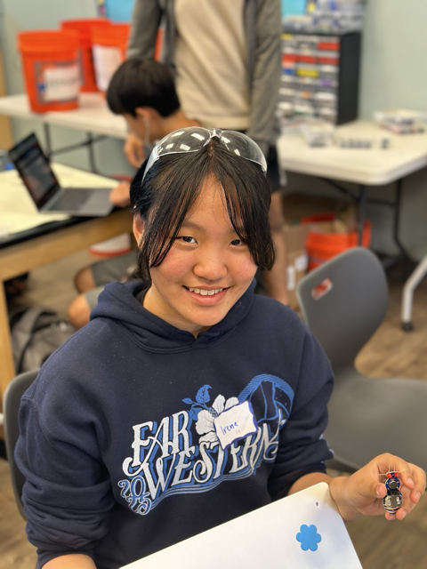
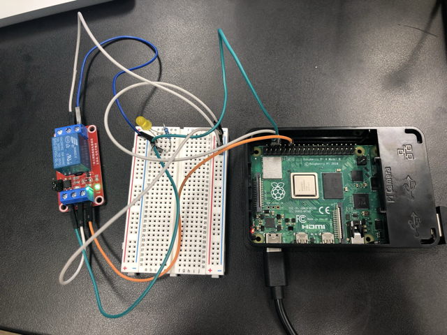
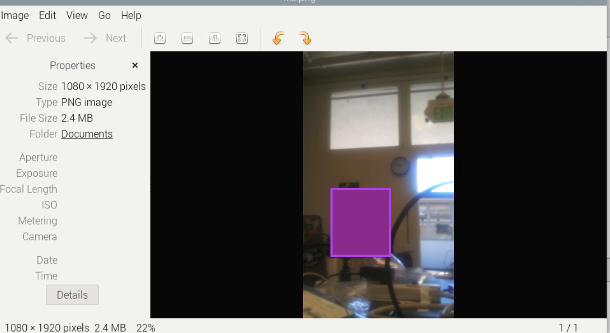
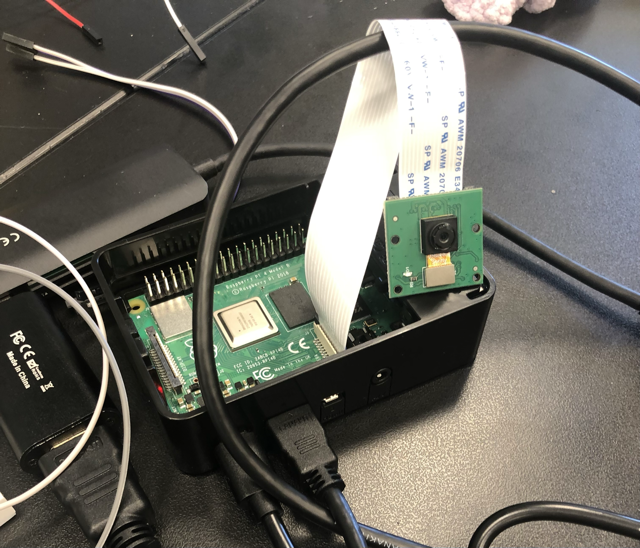
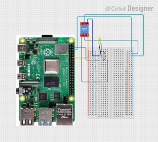

# Voice Assistant with AI

<!---

<span style="background-color:blue">

<!--- You should comment out all portions of your portfolio that you have not completed yet, as well as any instructions: -->

<!--- This is an HTML comment in Markdown -->
<!--- Anything between these symbols will not render on the published site -->

This voice assistant, dubbed Tom, serves uncertainty and assists with tasks such as turning off the lights. He answers intrusive questions with humor and entertainment through OpenAI and responds to words and statements that people make, which is similar to Siri or Alexa. 

| **Engineer** | **School** | **Area of Interest** | **Grade** |
|:--:|:--:|:--:|:--:|
| Irene L | Stratford Preparatory Blackford | Engineering | Incoming 8th Grader


<!--- **Replace the BlueStamp logo below with an image of yourself and your completed project. Follow the guide [here](https://tomcam.github.io/least-github-pages/adding-images-github-pages-site.html) if you need help.** -->


<!---  -->




  
# Final Milestone

<!--- 


<iframe width="560" height="315" src="https://www.youtube.com/embed/F7M7imOVGug" title="YouTube video player" frameborder="0" allow="accelerometer; autoplay; clipboard-write; encrypted-media; gyroscope; picture-in-picture; web-share" allowfullscreen></iframe>

For your final milestone, explain the outcome of your project. Key details to include are:
- What you've accomplished since your previous milestone
- What your biggest challenges and triumphs were at BSE
- A summary of key topics you learned about
- What you hope to learn in the future after everything you've learned at BSE -->

<iframe width="560" height="315" src="https://www.youtube.com/embed/9ElZHwI5Rrc?si=uWFZoYUpQ--ypO_Y" title="YouTube video player" frameborder="0" allow="accelerometer; autoplay; clipboard-write; encrypted-media; gyroscope; picture-in-picture; web-share" referrerpolicy="strict-origin-when-cross-origin" allowfullscreen></iframe>

## Description

For my third milestone, I added a speaker to my project and added to my program, using the dependency pyttsx3 (referred to as "engine" in the code) to respond to a question, statement, or command (reference appendix Milestone 3 Code). If the raspberry pi detects the word "Tom", it starts to search up the question or statement on OpenAI through the API key that was stated at the beginning of the code and shares OpenAI's response. When the light is turned on or off by one's voice command, it will affirm that the light has been turned on or off if the light has been successfully turned on or off. I set up Tom's voice as well as some properties of it. 

## Challenges

The main challenge at this steps was that my speaker was not outputting any sound at first, so I assumed that the code was wrong. However, I tried just running the function ```pyttsx3.say("hi")```, and it was still not working. I created the following test code to see if the speaker was actually attempting to say something but I just could not hear, and it always printed "working" in the terminal. 

  ```python
  if engine.isBusy(): #these two lines were to check that the speaker was trying to say something
    print("working")
```
I started thinking that it was less of the program's problem and more of the speaker's problem, so I plugged the speaker into my computer. It was playing music well, so I decided to plug it in again, and I discovered that while it was not silent, it was not loud enough to hear the words particularly well even at its highest volume. I decided to replace my speaker with a louder speaker so that I could hear the words that Tom says more clearly.

## Next Steps

Next, I will be starting on my modifications, which are attaching a servo to act as a door, sharing news, playing music, and always saying 'Tom' for the voice assistant to respond instead of only to prompt OpenAI. 

<!--- edit this later as needed --> 

## Progress at Bluestamp

At Bluestamp, I learned more about how breadboards work and about choosing a particular resistor using Ohm's law, V = I*R, as well as how to code a raspberry pi and configure the terminals on Mac and on SSH. My greatest triumphs were figuring out the WiFi problems that came each time I went to a different place because I could sometimes reach myself but could not connect to SSH or I could not reach myself in any way despite being on the same WiFi network. Most of the time, I had to reconnect WiFi and then try, but a few times that did not work either because the WiFi network that I used was no longer in range or had been turned off and the raspberry pi defaulted to the school network. The most formidable challenge was also related to the WiFi problems, especially surrounding how the school WiFi had several modems of the same WiFi, and my computer connected to a different modem than the raspberry pi did, so a WiFi with only one router was set up, and I used that one. 

After Bluestamp, I would like to learn more about breadboards and circuits, and I would like to build onto my newly formed knowledge of coding a raspberry pi in python. I would like to thank Vrinda, Ben, Kevin, and Sophia for their assistance during my project. 

# Second Milestone

<!---

<iframe width="560" height="315" src="https://www.youtube.com/embed/y3VAmNlER5Y" title="YouTube video player" frameborder="0" allow="accelerometer; autoplay; clipboard-write; encrypted-media; gyroscope; picture-in-picture; web-share" allowfullscreen></iframe>

For your second milestone, explain what you've worked on since your previous milestone. You can highlight:
- Technical details of what you've accomplished and how they contribute to the final goal
- What has been surprising about the project so far
- Previous challenges you faced that you overcame
- What needs to be completed before your final milestone -->

<iframe width="560" height="315" src="https://www.youtube.com/embed/oGpo41FJWgo?si=dcmZOr0RkHXzsA8w" title="YouTube video player" frameborder="0" allow="accelerometer; autoplay; clipboard-write; encrypted-media; gyroscope; picture-in-picture; web-share" referrerpolicy="strict-origin-when-cross-origin" allowfullscreen></iframe>

## Description

My second milestone was to build the circuit (reference appendix Schematic)and code the raspberry pi using python so that it could recognize words and follow commands to turn a light on and off (reference appendix Milestone 2 Code). By using a relay, an electrically powered switch that uses an electromagnet to physically move a switch, I was able to turn the LED on and off. The signal wire (orange in the  picture) is connected to GPIO pin 18, the ground wire (white/gray in the picture) is connected to ground, and the voltage wire (green in the picture) is connected to 5V power. The positive side (+ve; blue wire in the picture) is connected to normally opened (NO) in the relay, and the ground is connected to common terminal (COM). The python code uses this information and writes one (on) or zero (off) to GPIO pin 18, which is where the signal wire is connected. 


<br>
**Fig 1**: the circuit that runs the voice assistant code


## Challenges

During this milestone, at first, the light was not turning on when I tested it with the entire code but did turn on when I tested it without the relay. Initially, I created another program that would only test the relay and the LED, but the light still did not turn on and off (reference appendix Relay Testing Code (milestone 2)). I switched out the signal wire (IN1; orange in the picture) with another signal wire because that is the wire that is connected to GPIO pin 18 and that sends the signal to turn the LED on, yet that did not cause the LED to turn on and off. I checked my wiring, and there did not seem to be a problem with it, but I still tried writing both one and zero to figure out whether or not the schematic I was following switched NO and normally closed (NC). I switched out the relay, assuming that the relay had to be broken, and I was correct, but as I was running the program, I figured out that the schematic did in fact switch NO and NC, causing code that would technically turn the LED off to turn on and vice versa. 

Additionally, the WiFi was problematic, especially after I filmed a part of my milestone video and returned. I could not ping my raspberry pi in terminal, so I intended to use OBS (a software that I use to change the WiFi on the raspberry pi because it does not use VNC or SSH) to check the WiFi network that my raspberry pi was on. However, OBS did not recognize my raspberry pi as a device when I plugged it in initially. Upon restarting OBS and plugging in my raspberry pi again, OBS was able to recognize my raspberry pi, and I was correct--the raspberry pi had connected to another network because I was too far from the router I had used when I was working. 

## Next Steps

My third milestone will be allowing my raspberry pi to obtain answers from AI using the OpenAI API key that I obtained for part of my  first milestone and give verbal messages of affirmation that it turned the light on and off. 

---
# First Milestone

<!---

**Don't forget to replace the text below with the embedding for your milestone video. Go to Youtube, click Share -> Embed, and copy and paste the code to replace what's below.**

<iframe width="560" height="315" src="https://www.youtube.com/embed/CaCazFBhYKs" title="YouTube video player" frameborder="0" allow="accelerometer; autoplay; clipboard-write; encrypted-media; gyroscope; picture-in-picture; web-share" allowfullscreen></iframe>

For your first milestone, describe what your project is and how you plan to build it. You can include:
- An explanation about the different components of your project and how they will all integrate together
- Technical progress you've made so far
- Challenges you're facing and solving in your future milestones
- What your plan is to complete your project -->

<iframe width="560" height="315" src="https://www.youtube.com/embed/h5Dj9TAqHZk?si=AMRWgCxeZb4H8YMy" title="YouTube video player" frameborder="0" allow="accelerometer; autoplay; clipboard-write; encrypted-media; gyroscope; picture-in-picture; web-share" referrerpolicy="strict-origin-when-cross-origin" allowfullscreen></iframe>

## Description

My first milestone was to obtain the OpenAI API key and to set up the raspberry pi to use and interface with it as a computer. I chose this project because it was very different from last year--more focused on software than hardware and using raspberry pi instead of Arduino--and because I wanted to learn about interacting with AI. Virtual Network Computing (VNC), Secure Shell (SSH), and Visual Studio Code (VS Code) were used to create a headless setup. I imaged the raspberry pi, renamed the it, created a host name to connect to it, used a rasperry pi camera (or pi camera) to take photos (reference Raspberry pi imager code (milestone 1)), and downloaded updates and upgrades into the terminals of Visual Studio Code and the raspberry pi.

## Components and Software

For hardware, I used the raspberry pi, a keyboard and mouse, an SD card, and an SD card reader. I downloaded a raspberry pi imager in order to image the SD card of the raspberry pi and create a host name that would later be used in Visual Studio Code to connect to the raspberry pi. For displays, I used OBS, which displays the raspberry pi screen and TigerVNC Viewer, which allows the computer's keyboard and trackpad to be used instead and allows use of the raspberry pi without plugging in the SD card reader to the computer. I downloaded Visual Studio Code to code in python as well as updates and upgrades into the terminal of VS Code. 

### Images

---

note: I did not have permission to show this person's face, so I put a purple square over it.

<br>



<br>

**Fig 1**: this is an image that I took with the raspberry pi camera

<br>




<br>

**Fig 2**: raspberry pi setup with the raspberry pi camera

## Challenges

When I was first imaging the raspberry pi's SD card, I forgot that the imager only imaged the SD card, so I imaged it twice by accident. Halfway through the second time, I remembered that it was only supposed to image the SD card, and the imager seemed to be frozen at 100% in the verify stage. Upon pressing the "cancel" on the screen, I corrupted the SD card, and when I received a new SD card, I almost corrupted that one too because the imager was frozen at 100% verify from the start. After thirteen minutes of waiting, the imager finally finished imaging the second SD card, allowing me to take it out and use it. Visual Studio Code needed updating after I started it up for the second time after a few days, and that prevented me from filming my milestone video sooner. My raspberry pi camera was not working at first even after I plugged it in twice, and I only realized after plugging it in again that I had not plugged it in deep enough and that I had to push it a little more even with the possibility of it breaking.

### Next Steps

I will be starting on my second milestone, which allows one to interact with the voice assistant and allow it to do things (like open lights or doors), and I will build my circuit and start coding. 

---
# Starter Project
---
<iframe width="560" height="315" src="https://www.youtube.com/embed/f6nY_RwNvRg?si=etzqtukCnwUdpPpv" title="YouTube video player" frameborder="0" allow="accelerometer; autoplay; clipboard-write; encrypted-media; gyroscope; picture-in-picture; web-share" referrerpolicy="strict-origin-when-cross-origin" allowfullscreen></iframe>

## Description

I chose my starter project to be a jitterbug, which entailed soldering several parts onto the board because I had done the RGB slider the previous year and thought that this project would be a decent balance between difficulty (e.g. soldering and applications of soldering) and time consumption. The main components were the board, which was shaped like a bug, metal wire as the "legs" of the jitterbug, two red LEDs as the eyes, a switch, and a vibration motor, which causes the entire jitterbug to vibrate, or "jitter". The 5V nickel battery powers the LEDs and the vibration motor when the switch is turned on or flicked to the right.


**Fig 1:** an image of the jitterbug*
 
## Challenges

The jitterbug starter kit did not come with paper instructions, and the online instructions were rather unclear, so I looked at the picture and attempted to fit together the pieces how it was shown in the picture. I eventually figured it out by looking at the image more closely and stripping the wires. The vibration motor had two wires that needed to be soldered, but they were too thin to strip properly, and they did not fit properly like shown in the picture. I stripped the first one incorrectly and had to have the vibration motor replaced with another vibration motor that did end up fitting properly on the designated area, and I stripped it correctly and soldered it onto the board. These issues indirectly addressed and solved each other because of how all of the parts of the jitterbug are related to each other and how the placements affect each other.


**Fig 2:** the yellow circle shows the vibration motor, allows the jitterbug to "jitter", and the red and blue wires are extremely thin--unable to be stripped with a traditional wire stripper*


## Next Steps

After finishing the starter project and reviewing soldering, I will have started my intensive project, and my first milestone is setting up my raspberry pi and obtaining an OpenAI API key. 


<!--- note: add picture of my own project if possible-->


## Appendix
---

### Schematic (milestone 2)


---

### Raspberry pi imager code (milestone 1)

``` python

from picamera2 import Picamera2, Preview
import time
import cv2
picam2 = Picamera2()
camera_config = picam2.create_still_configuration(main={"size": (1920, 1080)},
lores={"size": (640, 480)}, display="lores")
picam2.configure(camera_config)
#picam2.start_preview(Preview.QTGL) #Comment this out if not using desktop interface
picam2.start()
time.sleep(2)
im = picam2.capture_array()
im = cv2.cvtColor(im, cv2.COLOR_BGR2RGB)
cv2.imwrite('file.png', im)
```

### Relay Testing Code (milestone 2)
``` python
import lgpio # to indicate GPIO pin number
from time import sleep # rest time

RELAY_GPIO_PIN = 18 # setting up the relay gpio pin at 18 (orange wire)

h = lgpio.gpiochip_open(4)

lgpio.gpio_claim_output(h, RELAY_GPIO_PIN)


lgpio.gpio_write(h, RELAY_GPIO_PIN, 1) # turn on
sleep(1) #rest 1 sec
lgpio.gpio_write(h, RELAY_GPIO_PIN, 0) # turn off
#sleep(1)

lgpio.gpiochip_close(h) #close & clean up
print("GPIO cleanup completed")
```
### Milestone 2 Code

```python

# importing the downloaded dependencies
import lgpio
import speech_recognition as sr # will be referred to as "sr" 
import pyttsx3 # text-to-speech conversion library
import openai

# Initializing pyttsx3
listening = True #means that it's listening
engine = pyttsx3.init() # setting up engine

# Set your openai api key and customize the chatgpt role
openai.api_key = "" #deleted key because others can access my OpenAI API key and use it if I keep it there
messages = [{"role": "system", "content": "Your name is Tom and give answers in 2 lines"}] #expectations/format

# Customizing the output voice: getting voices, rate, and volume
voices = engine.getProperty('voices') 
rate = engine.getProperty('rate')
volume = engine.getProperty('volume')


RELAY_GPIO_PIN = 18 # define relay GPIO pin #

h = lgpio.gpiochip_open(4) # initializing GPIO

lgpio.gpio_claim_output(h, RELAY_GPIO_PIN) #setting up GPIO as OUTPUT

def get_response(user_input):
    messages.append({"role": "user", "content": user_input}) # parameter "user_input" because it needs user input to give  a response
    response = openai.ChatCompletion.create( #getting the answer for the response
        model="gpt-3.5-turbo", #telling which model
        messages=messages
    )
    ChatGPT_reply = response["choices"][0]["message"]["content"] #format for giving answers
    messages.append({"role": "assistant", "content": ChatGPT_reply}) #also format
    return ChatGPT_reply # the thing that the function gives back

def turn_on_light():
    lgpio.gpio_write(h, RELAY_GPIO_PIN, 1) # makes RELAY_GPIO_PIN (18) 1, or HIGH (on)
    print("Light turned ON") # printing message of affirmation

def turn_off_light():
    lgpio.gpio_write(h, RELAY_GPIO_PIN, 0) # makes RELAY_GPIO_PIN (18) 0, or LOW (off)
    print("Light turned OFF") #printing message of affirmation


while listening: #listening was turned ON at the start of program
    with sr.Microphone() as source: #it listens from microphone & transcribes
        recognizer = sr.Recognizer() #recognizing the words
        recognizer.adjust_for_ambient_noise(source) #prevent ambient noise from clouding out the said words
        recognizer.dynamic_energy_threshold = 3000 #adjustment mechanism to detect speech

        try:
            print("Listening...") #response
            audio = recognizer.listen(source, timeout=5.0) #putting a timeout for the audio
            response = recognizer.recognize_google(audio) # response
            print(response) #printing the response
            
            if "turn on the light" in response.lower(): # if it hears "turn on the light"
                turn_on_light()            

            elif "turn off the light" in response.lower(): # if it hears "turn off the light"
                turn_off_light()
                
            else:
                print("Didn't recognize 'turn on the light' or 'turn off the light'.")

                engine.say("did not recognize")

               # if engine.isBusy(): (these two lines were to check that the speaker was trying to say something)
                  # print("working")

        except sr.UnknownValueError:
            print("Didn't recognize anything.")


# Clean up GPIO on exit
lgpio.gpiochip_close(h)
print("GPIO cleanup completed")
```
### Milestone 3 Code
```python

# importing the downloaded dependencies
import lgpio
import speech_recognition as sr # will be referred to as "sr" 
import pyttsx3 # text-to-speech conversion library
import openai

# Initializing pyttsx3
listening = True #means that it's listening
engine = pyttsx3.init() # setting up engine

# Set your openai api key and customize the chatgpt role
openai.api_key = "" # API keys are supposed to be private
messages = [{"role": "system", "content": "Your name is Tom and give answers in 2 lines"}] #expectations/format

# Customizing the output voice: getting voices, rate, and volume
voices = engine.getProperty('voices') 
rate = engine.getProperty('rate')
volume = engine.getProperty('volume')

engine.setProperty('rate', 120) # talk at 120 words per minute
engine.setProperty('volume', volume) #setting up volume
engine.setProperty('voice', 'british') #setting up the voice


RELAY_GPIO_PIN = 18 # define relay GPIO pin #

h = lgpio.gpiochip_open(4) # initializing GPIO

lgpio.gpio_claim_output(h, RELAY_GPIO_PIN) #setting up GPIO as OUTPUT

def get_response(user_input):
    messages.append({"role": "user", "content": user_input}) # parameter "user_input" because it needs user input to give  a response
    response = openai.ChatCompletion.create( #getting the answer for the response
        model="gpt-3.5-turbo", #telling which model
        messages=messages
    )
    ChatGPT_reply = response["choices"][0]["message"]["content"] #format for giving answers
    messages.append({"role": "assistant", "content": ChatGPT_reply}) #also format
    return ChatGPT_reply # the thing that the function gives back

def turn_on_light():
    lgpio.gpio_write(h, RELAY_GPIO_PIN, 1) # makes RELAY_GPIO_PIN (18) 1, or HIGH (on)
    print("Light turned ON") # printing message of affirmation
    engine.say("Light turned on") # saying the message
    engine.runAndWait()

def turn_off_light():
    lgpio.gpio_write(h, RELAY_GPIO_PIN, 0) # makes RELAY_GPIO_PIN (18) 0, or LOW (off)
    print("Light turned OFF") #printing message of affirmation
    engine.say("Light turned off") # saying the message
    engine.runAndWait()


while listening: #listening was turned ON at the start of program
    with sr.Microphone() as source: #it listens from microphone & transcribes
        recognizer = sr.Recognizer() #recognizing the words
        recognizer.adjust_for_ambient_noise(source) #prevent ambient noise from clouding out the said words
        recognizer.dynamic_energy_threshold = 3000 #adjustment mechanism to detect speech

        try:
            print("Listening...") #response
            audio = recognizer.listen(source, timeout=5.0) #putting a timeout for the audio
            response = recognizer.recognize_google(audio) # response
            print(response) #printing the response

            if "tom" in response.lower(): #THIS causes it to use the API key and ask AI for the answer        
                response_from_openai = get_response(response) #get the response
                engine.setProperty('rate', 120) # talk at 120 words per minute
                engine.setProperty('volume', volume) #setting up volume
                engine.setProperty('voice', 'british') #setting up the voice
                engine.say(response_from_openai) # say the response from openai
                engine.runAndWait() # run this and wait
            
            elif "turn on the light" in response.lower():
                turn_on_light()     

            elif "turn off the light" in response.lower():
                turn_off_light() 
                print("Light turned off")
                engine.say("Light turned off.")
                
            else:
                print("Didn't recognize 'turn on the light' or 'turn off the light'.")

                engine.say("did not recognize")

               # if engine.isBusy(): (these two lines were to check that the speaker was trying to say something)
                  # print("working")

        except sr.UnknownValueError:
            print("Didn't recognize anything.")


# Clean up GPIO on exit
lgpio.gpiochip_close(h)
print("GPIO cleanup completed")
```


# Bill of Materials
<!--- Here's where you'll list the parts in your project. To add more rows, just copy and paste the example rows below.
Don't forget to place the link of where to buy each component inside the quotation marks in the corresponding row after href =. Follow the guide [here]([url](https://www.markdownguide.org/extended-syntax/)) to learn how to customize this to your project needs. -->

| **Part** | **Note** | **Price** | **Link** |
|:--:|:--:|:--:|:--:|
| CanaKit Raspberry Pi 4 Starter Kit | For the raspberry pi and other components |$99.95 | <a href="https://www.canakit.com/raspberry-pi-4-starter-kit.html?srsltid=AfmBOoplo-24tOUwhJMTwgXgCyijmcd7C5zVU6w0b_UMkb5S2RmnGfCK"> Link </a> |
| Speaker | to output the sound | $13.98 | <a href="https://www.amazon.com/dp/B0CJJKF2Q2/ref=sspa_dk_detail_0?pd_rd_i=B0CJJKF2Q2&pd_rd_w=LBb0I&content-id=amzn1.sym.386c274b-4bfe-4421-9052-a1a56db557ab&pf_rd_p=386c274b-4bfe-4421-9052-a1a56db557ab&pf_rd_r=DFMF2MAPCGDV5KTYS0JA&pd_rd_wg=Jg8Ie&pd_rd_r=e676099d-1ee0-44bc-8a05-6aac8ad6ab06&sp_csd=d2lkZ2V0TmFtZT1zcF9kZXRhaWxfdGhlbWF0aWM&th=1"> Link </a> |
| Microphone | To input the noise | $6.96 | <a href="https://www.amazon.com/Wisoqu-Microphone-Cancelling-Ultracompact-Compatible/dp/B0DGQTHKCT"> Link </a> |
| Breadboard | For the circuit | $6.48 | <a href="https://www.amazon.com/DEYUE-breadboard-Set-Prototype-Board/dp/B07LFD4LT6/ref=sr_1_1_sspa?crid=WKDWMC95XWLT&dib=eyJ2IjoiMSJ9.5Z5yTwL-oa1r18Ah_zf9OXg0u1AVX54R3VfgSdqpBoQF-pb3vaYF9fEFc-CfIOeneZTl6n9i6Kw0I-CHleppmKaZjmKyijtZyQNKDc1qYFC4PZnxZrFe9_A6Z0Hc2-yRuFgv7WaQqJ9gYxs0iapxXK7ZjXygZ093Tbswo4BFD9Yxuyth4OJJ-FUa9mhwjIDf3tzhrGA7EYt5CiJzN82OXhhtoak0EvpRDSLvh3Pzfv0.M-LPZ9BDvq5_OXeVN6XIWQaL9Q7DvgemN27y5I34rGQ&dib_tag=se&keywords=breadboard&qid=1751062342&sprefix=breadboar%2Caps%2C185&sr=8-1-spons&sp_csd=d2lkZ2V0TmFtZT1zcF9hdGY&psc=1"> Link </a> |
| Wires (male-male, female-male, female-female) | To build the circuit | $7.39 for 40 of each | <a href="https://www.amazon.com/ZYAMY-120PCS-Connector-Multicolor-Breadboard/dp/B0742RS6YL"> Link <a> |
| Yellow LED | To light up and act as the light | $5.69 for 100 | <a href="https://www.amazon.com/GFORTUN-Emitting-Diffused-Electronic-Indicator/dp/B08D3SYH87/ref=sr_1_3?crid=1W67RSGLPCVJV&dib=eyJ2IjoiMSJ9.bLvzpb5Fds2c7h3EaTFvnTBDhtp3wAa_9eQs5Y_GYz78H_r9_wNGmVSAFHKYWRsj-_SKsw20bMxYov-uRntaZqvjY5g8Qo9mvyDtOrUXPKsRsFzxfw_K5CMDgnn7xkbH0Kfve5mNP593Sd9jDQdZ0lf48A0I4KTB-rCPBdwI_9sp6QLbO8CDOl-tXi6a-pHjM7aU7usEv7K8ZyVwcIHRyBZhAFg64-oxR33XPcjXW2DvDx7lG05_nsoHLcMnsfCvM44dlxkNWGi7xyGQ9krIfTtVBsomGySj2nAtxnjLbjE.fYPqHWFqdMaCmiCp_kW-1JTa-uCYNQSLbEOAA7BZ9gE&dib_tag=se&keywords=yellow%2Bpin%2BlED&qid=1751062472&s=industrial&sprefix=yellow%2Bpin%2Bled%2Cindustrial%2C158&sr=1-3&th=1"> Link <a> |
| 220 ohm resistor | To regulate electric flow | $0.10 | <a href="https://www.addicore.com/products/220-ohm-1-4w-precision-resistor"> Link </a> |


# Other Resources/Examples
<!--- One of the best parts about Github is that you can view how other people set up their own work. Here are some past BSE portfolios that are awesome examples. You can view how they set up their portfolio, and you can view their index.md files to understand how they implemented different portfolio components. -->
- [Example 1](https://pyttsx3.readthedocs.io/en/latest/)
- [Example 2](https://learntosolderkits.com/pages/instructions)
- [Example 3](https://sites.google.com/bluestampengineering.com/2025projectbook/level-200)

To watch the BSE tutorial on how to create a portfolio, click here.
